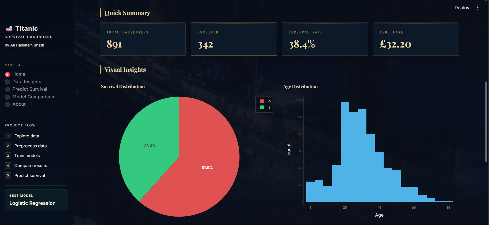
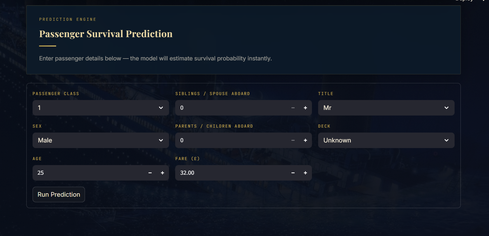
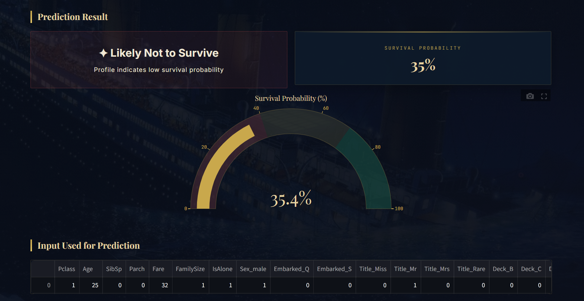

# 🐍 Python AI Dashboard | Titanic Survival Prediction using Machine Learning

A modern **Artificial Intelligence (AI)** web application built with **Python**, **Machine Learning**, and **Streamlit** to predict the survival probability of Titanic passengers.

The project compares multiple machine learning classification algorithms, evaluates their performance using standard metrics, and deploys the best-performing model in an interactive dashboard.

---

## ✨ Features

* 🤖 AI-powered survival prediction
* 📊 Comparison of multiple Machine Learning models
* 📈 Interactive data visualizations
* 🎯 Real-time prediction with probability score
* 📋 Clean and responsive Streamlit interface
* ⚡ Fast and lightweight application
* 📉 Model performance comparison dashboard

---

# 🧠 Machine Learning Models

The following classification models were trained and evaluated:

* Logistic Regression
* Decision Tree Classifier
* K-Nearest Neighbors (KNN)

After evaluation, **Logistic Regression** achieved the best overall performance and was selected for deployment.

---

# 📊 Evaluation Metrics

Models were evaluated using:

* Accuracy
* Precision
* Recall
* F1 Score
* ROC-AUC Score

These metrics provide a comprehensive comparison of model performance.

---

# ⚙️ Tech Stack

## Programming Language

* Python

## Artificial Intelligence & Machine Learning

* Scikit-learn

## Data Analysis

* Pandas
* NumPy

## Data Visualization

* Plotly
* Matplotlib
* Seaborn

## Web Framework

* Streamlit

## Model Serialization

* Joblib

---


# 🔄 Project Workflow

```text
Titanic Dataset
        │
        ▼
Data Preprocessing
        │
        ▼
Feature Engineering
        │
        ▼
Train-Test Split
        │
        ▼
Model Training
        │
        ▼
Model Evaluation
        │
        ▼
Best Model Selection
        │
        ▼
Streamlit Dashboard
        │
        ▼
Passenger Survival Prediction
```

---

# 📊 Dataset

**Dataset:** Titanic Passenger Dataset

**Source:** Kaggle Titanic Competition

The dataset contains passenger information including:

* Passenger Class
* Gender
* Age
* Fare
* Family Information
* Cabin Details
* Port of Embarkation
* Survival Status

---

# 🚀 Installation

## 1. Clone the repository

```bash
git clone https://github.com/alibhatti59/Titanic-Survival-Prediction-AI-Python.git
```

## 2. Navigate to the project

```bash
cd Titanic-Survival-Prediction-AI-Python
```

## 3. Create a virtual environment

### Windows

```bash
python -m venv venv
```

Activate it

```bash
venv\Scripts\activate
```

---

## 4. Install dependencies

```bash
pip install -r requirements.txt
```

---

## 5. Run the application

```bash
streamlit run app.py
```

The application will automatically open in your browser.

---

# 📸 Screenshots

## Home Page



---

## Prediction Page



---

## Prediction Result



---

# 📈 Future Improvements

* Deploy on Streamlit Community Cloud
* Add more machine learning algorithms
* Hyperparameter optimization using GridSearchCV
* User authentication
* Database integration
* Explainable AI (SHAP/LIME)
* Docker support
* Cloud deployment

---

# 🛠 Requirements

* Python 3.10+
* Streamlit
* Pandas
* NumPy
* Scikit-learn
* Plotly
* Matplotlib
* Seaborn
* Joblib

Install all dependencies using:

```bash
pip install -r requirements.txt
```

---

# 🤝 Contributing

Contributions are welcome.

If you'd like to improve this project:

1. Fork the repository
2. Create a new branch
3. Commit your changes
4. Open a Pull Request

---

# 📄 License

This project is licensed under the MIT License.

---

# 👤 Author

**Ali Hassnain Bhatti**

* GitHub: https://github.com/alibhatti59
* Email: [thealibhatti.dev@gmail.com](mailto:thealibhatti.dev@gmail.com)

---

⭐ If you found this project helpful, consider giving it a **Star** on GitHub.
